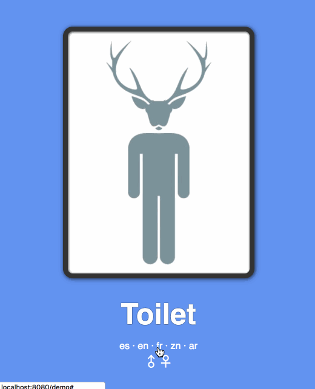

# Customizer

Utilidad _FrontEnd_ para la personalización de textos por idioma y estilos CSS. 



## Desarrollo

La lógica se basa en el patrón Observer (implementación _signals_) para automatizar los cambios de idioma y estilos en tiempo de ejecución.
El proyecto está construido mediante Webpack he incorpora los scripts necesarios para su desarrollo: 

* `npm run build` - Genera una versión minificada para producción.
* `npm run dev` - Genera una versión no minificada para desarrollo y lanza un _watcher_ para recompilar a cada modificación de archivos.
* `npm run demo` - Lanza un servidor para ver una demostración de la utilidad, accediendo a _http://localhost:8080/demo_.
* `npm run test` - Ejecuta los test del proyecto.
* `npm run test:watch` - Ejecuta los test del proyecto y lanza un _watcher_ para recompilar a cada modificación de archivos.
        
### Uso

#### Requisitos
Para usar esta utilidad, la aplicación debe cumplir con unas convenciones.

##### Textos
1. Los textos a actualizar en el cambio de idioma deberán estar contenidos dentro de elementos HTML con el atributo `data-translate`.
Este atributo tendrá como valor la clave que se corresponde con el texto que se mostrará a partir de un JSON:

    ```html
    <span data-translate="saludo"></span>
    ```
1. La estructura del JSON de textos tendrá dos niveles: idioma y textos:
    ```javascript
    var strings = {
      'es': {'saludo': 'Hola'},
      'en': {'saludo': 'Hello'}
    };
    ```
    
##### Estilos
1. En enlace de la hoja de estilos debe tener el id `skin`:
 
    ```html
    <link id="skin" rel="stylesheet" href="css/male.min.css">
    ```
1. Las hojas de estilo deberán estar en el mismo directorio y tener el mismo sufijo, ya sea `.css` o `.min.css`

#### Inicialización
Una vez añadida la librería a una aplicación, debe inicializarse mediante dos parámetros:

```javascript
Customizer.init(stringsProvider, config)
```

#### Parámetros

* _stringsProvider_: Objeto javascript que debe implementar el método `getString(key)`. De lo contrario se lanzará un _TypeError_.
Una implementación básica usaría un JSON estático como _datasource_:

    ```javascript
      var strings = {
        'es': {'saludo': 'Hola'},
        'en': {'saludo': 'Hello'}
      };
    
      var stringsProvider = (function () {
        return {
          getString: function (lang, key) {
            return strings[lang][key];
          }
        };
      })();
    ```
    
    En un caso más avanzado se podría usar un servicio de textos cacheando las respuestas:
    ```javascript
      const stringsProvider = (function () {
        const textService = 'http://server/rest/texts-service/';
        const strings = {};
        const promises = {};
        
        return {
          getString: function (lang, key) {
            // Si ya está cacheado el idioma devolvemos el string.
            if (strings[lang]) {
              return strings[lang][key];
            }
            // Si no hay una petición asíncrona iniciada la creamos.
            if(!promises[lang]) {
              promises[lang] = fetch('http://localhost:8080/api/rest/translate/workshop/' + lang)
                .then((resp) => resp.json())
                .then((json) => { 
                  strings[lang] = json.response.data;
                  // Finalmente devolvemos el string.
                  return strings[lang][key];
                });
            }
            // Devolvemos la promesa, resuelta o en curso.
            return promises[lang];
          }
        };
      })();
    ```
* _config_: Objeto JSON de configuración con los elementos que se deseen sincronizar y sus valores iniciales:

    ```javascript
    var config = {
      'language': 'es_ES',
      'skin': 'main'
    };
    ```


    El valor por defecto de `language` es _es_ES_, y el de `skin` _styles_.
    
    
    En cualquier caso, **para sincronizar los cambios de estos atributos, se deberán incluir en el objeto de configuración inicial**.
    
### API

La utilidad _Customizer_ expone una serie de métodos para facilitar la customización de textos y estilos en tiempo real, ocultando la lógica implicada y simplificando el desarrollo.

### Métodos

* **`init(stringsProvider, config)`** - Inicializa la sincronicación de textos y estilos de la aplicación con cambios en la configuración de lenguaje y los estilos respectivamente.
* **`changeLanguage(lang)`** - Cambia el lenguaje de la aplicación en la configuración y actualiza automáticamente los textos vinculados. El valor del parámetro `lang` debe ser uno de los identificadores de idioma definidos en el `stringsProvider`.       
* **`changeSkin(skin)`** - Cambia los estilos de la aplicación actualizando el enlace del archivo CSS con el nuevo valor. El parámetro `skin` debe corresponderse con el nombre de la hoja de estilos sin ruta ni sufijo. 
Por ejemplo, si el estilo inicial está en _http://server/css/style.min.css_, un cambio a un `skin` llamado _style-new_ debería tener la ruta _http://server/css/style-new.min.css_.

### Demo
En la propia utilidad se incluye una demo _responsive_ mostrando el funcionamiento de la utilidad, sincronizando un texto con el cambio de idioma y facilitando el cambio del aspecto visual general.

#### Prueba en local
1. `> git clone <este repositorio>`  
1. `> cd <directorio clonado>`
1. `> npm install` 
1. `> npm run demo`
1. Abrir en un navegador la URL `http://localhost:8080/demo` (El puerto puede variar de manera incremental si 8080 ya está en uso).
